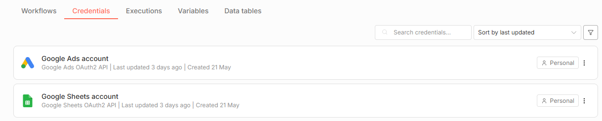

# 로컬 N8N을 이용해 구글광고 초기등록을 진행해보자.

마케팅팀에서 구글최초 광고 등록하는데 리소스가 많이 들어서 N8N을 이용해 자동화하기로 했다.

서버를 세팅해서 진행하면 비용이 들기 때문에 로컬머신(Self-host)에서 진행한다.
*회사에 남는 컴퓨터들이 많이있었다.

현재 버전은 구글 시트에서 값을 읽어와 오전10시에 구글광고를 등록하는 형태이다.

검증을 한번 해야하기에 PAUSED 상태로 진행한다.

이번 단계에서는 n8n 세팅과 credential 설정을 진행한다.

## 준비

- Docker
- N8N (로컬에 설치했다.)
- Google Cloud Console
    - 프로젝트 생성
    - API 활성화 (Google Ads API, Google Sheets API, Google Drive API)
    - OAuth Client ID 생성 (Web application)
- 구글광고 계정 (광고계정과 MCC계정)
- 구글 시트

# 구현

## 1. 로컬에 Docker를 설치한다.

Docker Desktop을 설치한다.

## 2. n8n 이미지를 받는다.
```bash
docker pull docker.n8n.io/n8nio/n8n # 최신버전
```

## 3. n8n 이미지를 실행한다.

1. 기본 포트인 5678로 설정
2. volumns
    - host path : n8n_data
    - container path : /home/node/.n8n
3. Environment variables
    - Variable : Value
        - GENERIC_TIMEZONE : Asia/Seoul
        - TZ : Asia/Seoul

## 4. n8n credential 추가

### 4-1. Google Cloud Console 설정

1. Google Cloud Console에서 프로젝트를 생성한다.
2. Google Cloud Console에서 API를 활성화한다.
    - Google Ads API, Google Sheets API, Google Drive API
3. Google Cloud Console에서 사용자 인증 정보에 OAuth Client ID를 생성한다. (Web application)
    - Client Type : Web application
    - Authorized redirect URIs : http://localhost:5678/rest/oauth2-credential/callback
    - client id 와 클라이언트 보안 비밀번호를 복사해둔다.

### 4-2. 구글 관리자 계정 토큰 발급

1. Google Ads API에서 "구글 관리자 계정 토큰"을 발급받는다.

### 4-3. n8n Google Ads credential 추가

1. n8n에 접속해서 credential을 추가한다.
2. Google Ads credential을 추가한다.
    - OAuth Redirect URL : http://localhost:5678/rest/oauth2-credential/callback
    - Client ID : 발급받은 ID
    - Client Secret : 발급받은 Secret
    - Refresh Token : 발급받은 토큰

### 4-4. n8n Google Sheets credential 추가
1. Google Sheets credential 추가
    - OAuth Redirect URL : http://localhost:5678/rest/oauth2-credential/callback
    - Client ID : 발급받은 ID
    - Client Secret : 발급받은 Secret

### 4-5. 최종 credential



